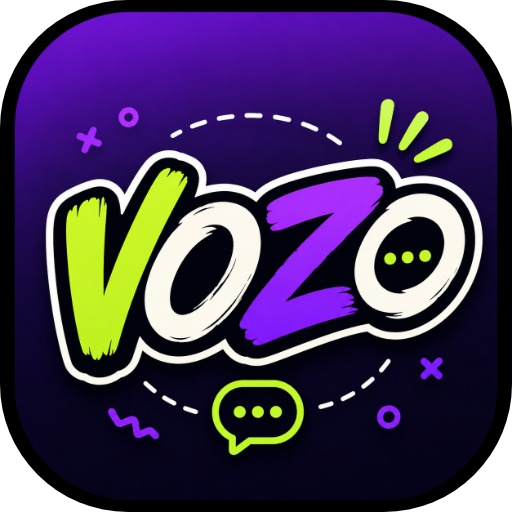
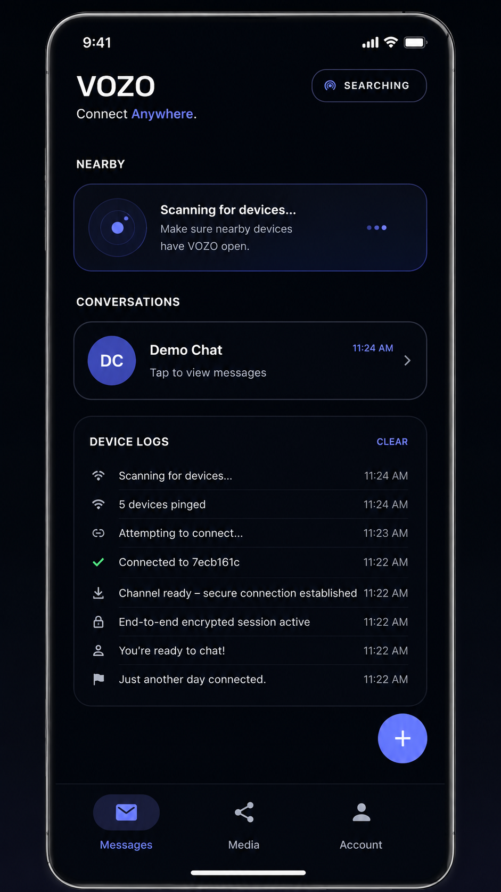
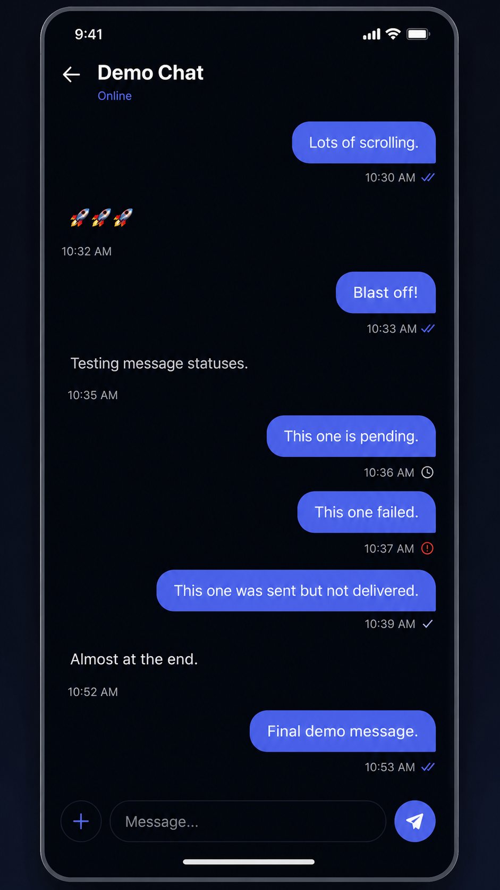
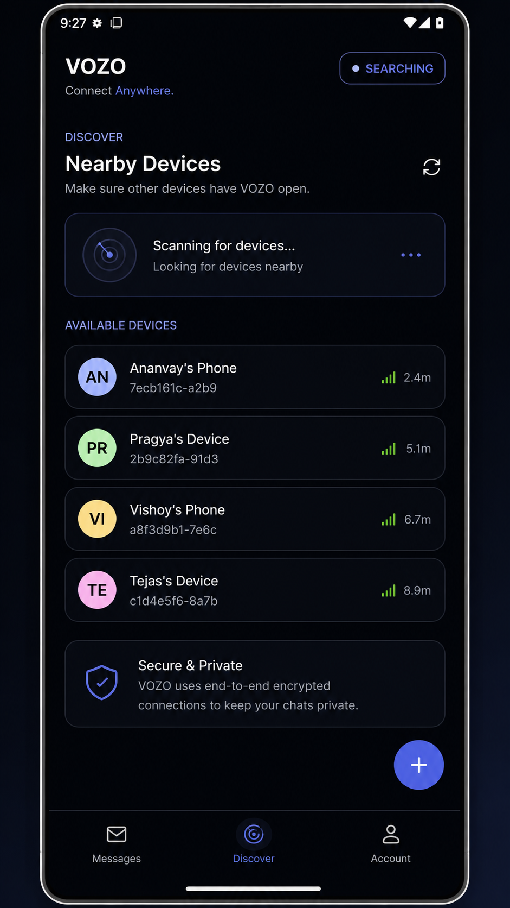
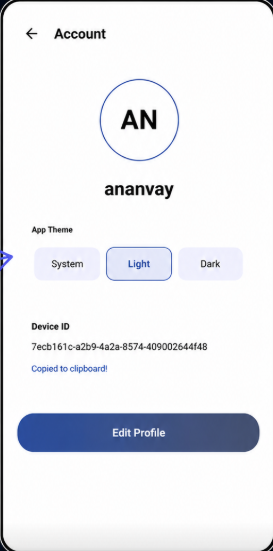

<div align="center">


<br>




### Chat Beyond the Internet

*Modern Offline Messaging Platform*

<p>

<a href="https://play.google.com/store/apps/details?id=com.aistudio.vozo.kdnoqm">

</a>

<a href="https://www.voikestechnologies.com/">

</a>


</p>

</div>

---

# 🌍 What is VOZO?

VOZO is a modern **offline-first messaging application** that allows users to communicate **without mobile data, internet, SIM cards, or traditional messaging infrastructure.**

Built using **Google Nearby Connections API**, VOZO enables seamless peer-to-peer communication over Bluetooth and Wi-Fi Direct.

---

# ✨ Features

- 💬 Offline Messaging
- 📷 Image Sharing
- 📁 File Transfer
- 👥 Create Groups
- 📍 Nearby Device Discovery
- ⚡ Fast Peer-to-Peer Connections
- 🔒 Secure Local Communication
- 🌐 No Internet Required
- 📡 Bluetooth Connectivity
- 📶 Wi-Fi Direct Support

---

# 🎬 Demo

<p align="center">


</p>

---

# 📱 Screenshots

| Home | Chats |
|------|-------|
|  |  |

| Nearby Devices | Settings |
|------|------|
|  |  |

---

# ⚙️ Tech Stack

<div align="center">


</div>

---

# 🏗 Architecture

```text
Nearby Devices
       │
       ▼
Device Discovery
       │
       ▼
Secure Connection
       │
       ▼
Message Transfer
       │
       ▼
Images & Files
       │
       ▼
Delivered Offline
```

---

# 🚀 Core Technologies

| Technology | Usage |
|------------|------|
| Nearby Connections API | Device Discovery |
| Bluetooth | Offline Communication |
| Wi-Fi Direct | High-Speed Transfer |
| Android | Native Platform |
| Kotlin | App Development |
| Material Design 3 | UI |

---

# 🔥 Why VOZO?

✅ Works without Internet

✅ No SIM Required

✅ Lightning Fast

✅ Secure Local Messaging

✅ Easy Device Discovery

✅ Beautiful Material UI

---

# 🎯 Use Cases

🏫 College Campuses

🏕 Camping

🚑 Emergency Communication

🎉 Festivals

🏢 Offices

🌍 Rural Areas

Military Exercises

Disaster Recovery

---

# 📈 Roadmap

- [x] Offline Messaging
- [x] Nearby Discovery
- [x] Bluetooth Connections
- [x] Wi-Fi Direct
- [x] Image Sharing
- [x] File Sharing
- [ ] Voice Messages
- [ ] Video Sharing
- [ ] Offline Calling
- [ ] Mesh Networking
- [ ] Cross Platform Support

---

# 📊 Repository Stats

<p align="center">


</p>

---

# 🌟 Powered By

<div align="center">


</div>

---

# ❤️ Developed By

<div align="center">


## VOIKES Technologies Pvt. Ltd.

### Building Human-Centered Technology

Made with ❤️ in India 🇮🇳

</div>

---

<div align="center">


<br>


</div>
