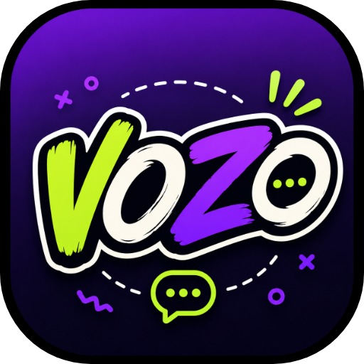
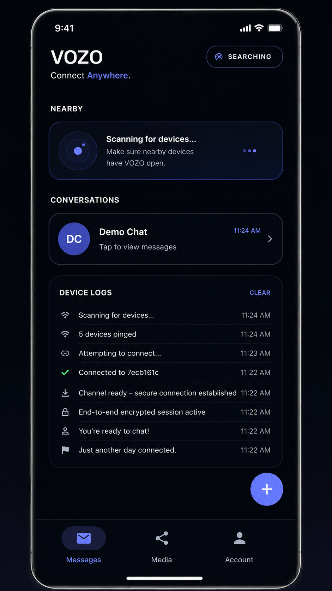
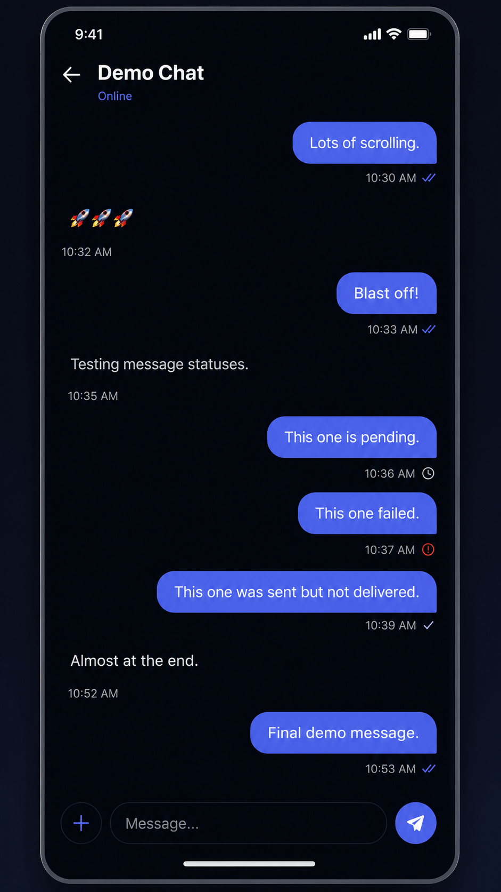
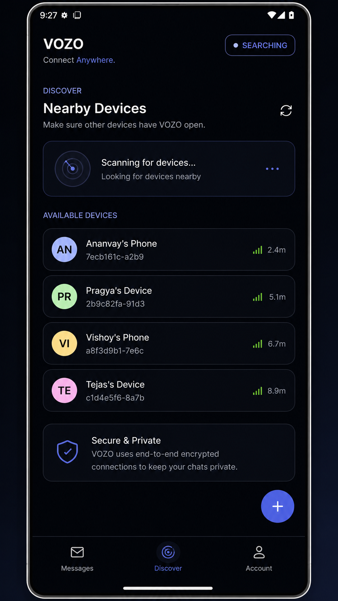
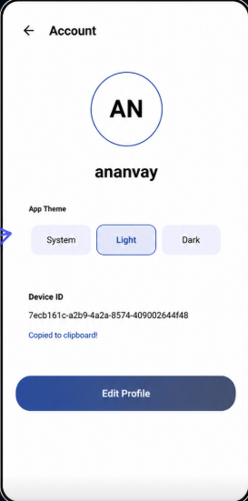

<div align="center">


<br>




### Chat Beyond the Internet

*Modern Offline Messaging Platform*

<p>

<a href="https://play.google.com/store/apps/details?id=com.aistudio.vozo.kdnoqm">

</a>

<a href="https://www.voikestechnologies.com/">

</a>


</p>

</div>

---

# Phase 03 — Peer-to-Peer Mesh (in development)

VOZO is being rebuilt as a **Kotlin Multiplatform (Compose Multiplatform)** app
targeting Android (Play Store) + Windows + macOS. Offline-first, P2P mesh.

> Legacy Google AI Studio prototype content below is retained for reference
> and will be replaced as development proceeds.

## Current status (P03)
- **Two phones can now talk to each other with no internet.** Peers are found
  and connected over Bluetooth / Wi-Fi Direct using Google Nearby Connections.
- Messages are written to the local database first, then sent to the peer.
- The **Mesh** tab shows live discovered peers and their connection state.
  Tap a peer to open a direct chat.
- Everything is still stored locally, so history survives offline.
- Desktop joins the mesh in P05 (hotspot + mDNS/TCP).

## How to test with two phones
1. Install `vozo-debug.apk` on **both** phones (Android 6+, Google Play Services).
2. Launch VOZO on both and allow the Nearby / Bluetooth / Location permissions.
3. Open the **Mesh** tab on both. Each phone should list the other.
4. Tap the peer, type a message, send. It should appear on the other phone.
5. Turn off Wi-Fi and mobile data on both to confirm it is truly offline.

If the Mesh tab stays empty, check that Location is enabled (Android requires
it for peer discovery) and that both phones are within a few metres.

## Project layout
```
app/
  vozo/
    src/commonMain/       shared UI + data (theme, nav, screens, ChatStore, mesh)
    src/commonMain/sqldelight/   SQLite schema
    src/androidMain/      Android entry + Nearby transport + SQLite driver
    src/desktopMain/      desktop entry + SQLite driver (mesh in P05)
  gradle/libs.versions.toml
```

## Build
```bash
cd app
./gradlew :vozo:assembleDebug              # Android APK
./gradlew :vozo:packageMsi/packageExe      # Windows installer
./gradlew :vozo:run                        # run desktop app
```

Requires JDK 17+ and Android SDK (see `app/local.properties`).

---

# 🌍 What is VOZO?

VOZO is a modern **offline-first messaging application** that allows users to communicate **without mobile data, internet, SIM cards, or traditional messaging infrastructure.**

Built using **Google Nearby Connections API**, VOZO enables seamless peer-to-peer communications over different alternatives as BLUETOOH and WIFI

---

# ✨ Features

- 💬 Offline Messaging
- 📷 Image Sharing
- 📁 File Transfer
- 👥 Create Groups
- 📍 Nearby Device Discovery
- ⚡ Fast Peer-to-Peer Connections
- 🔒 Secure Local Communication
- 🌐 No Internet Required
- 📡 Bluetooth Connectivity
- 📶 Wi-Fi Direct Support

---

# 🎬 Demo

<p align="center">


</p>

---

# 📱 Screenshots

| Home | Chats |
|------|-------|
|  |  |

| Nearby Devices | Settings |
|------|------|
|  |  |

---

# ⚙️ Tech Stack

<div align="center">


</div>

---

# 🏗 Architecture

```text
Nearby Devices
       │
       ▼
Device Discovery
       │
       ▼
Secure Connection
       │
       ▼
Message Transfer
       │
       ▼
Images & Files
       │
       ▼
Delivered Offline
```

---

# 🚀 Core Technologies

| Technology | Usage |
|------------|------|
| Nearby Connections API | Device Discovery |
| Bluetooth | Offline Communication |
| Wi-Fi Direct | High-Speed Transfer |
| Android | Native Platform |
| Kotlin | App Development |
| Material Design 3 | UI |

---

# 🔥 Why VOZO?

✅ Works without Internet

✅ No SIM Required

✅ Lightning Fast

✅ Secure Local Messaging

✅ Easy Device Discovery

✅ Beautiful Material UI

---

# 🎯 Use Cases

🏫 College Campuses

🏕 Camping

🚑 Emergency Communication

🎉 Festivals

🏢 Offices

🌍 Rural Areas

Military Exercises

Disaster Recovery

---

# 📈 Roadmap

- [x] Offline Messaging
- [x] Nearby Discovery
- [x] Bluetooth Connections
- [x] Wi-Fi Direct
- [x] Image Sharing
- [x] File Sharing
- [ ] Voice Messages
- [ ] Video Sharing
- [ ] Offline Calling
- [ ] Mesh Networking
- [ ] Cross Platform Support

---

# 📊 Repository Stats

<p align="center">


</p>

---

# 🌟 Powered By

<div align="center">


</div>

---

# ❤️ Developed By

<div align="center">


## VOIKES Technologies Pvt. Ltd.

### Building Human-Centered Technology

Made with ❤️ in India 🇮🇳

</div>

---

<div align="center">


<br>


</div>
